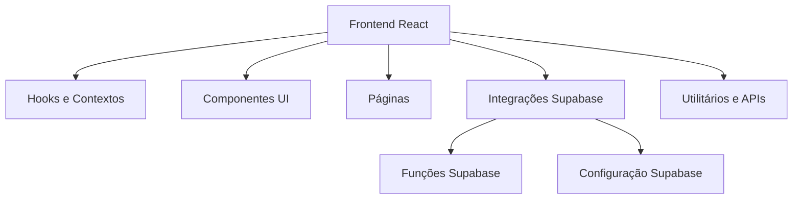
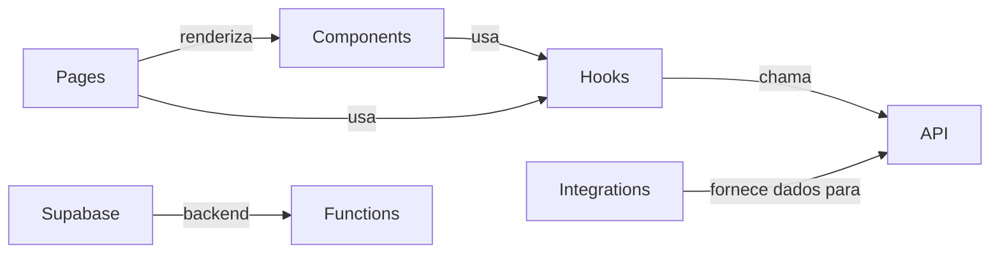
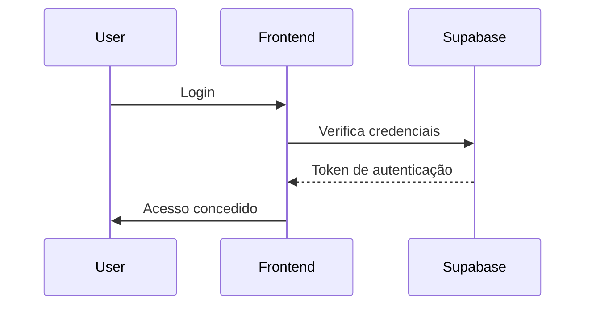

# Documentação do Projeto Renum AI Hub

## 1. Introdução
Este documento tem como objetivo descrever a estrutura, funcionalidades e arquitetura do projeto Renum AI Hub, uma plataforma para criação e gerenciamento de agentes de IA que podem ser integrados a outros sistemas, aplicativos e sites. A documentação inclui diagramas Mermaid para facilitar a visualização da arquitetura e dos principais módulos.

## 2. Visão Geral do Projeto
O Renum AI Hub é uma plataforma que permite aos usuários criar seus próprios agentes de IA, conectá-los a outras ferramentas e integrá-los a sistemas externos. O backend é baseado em Supabase, que oferece APIs RESTful, funções serverless e suporte a webhooks para facilitar a integração.

## 3. Arquitetura do Sistema

## 4. Principais Módulos e Relações

## 5. Fluxo de Autenticação

## 6. Plano de Integração dos Agentes com Sistemas Externos

### 6.1 Contexto do Backend
O backend do Renum AI Hub é baseado em Supabase, que oferece APIs RESTful automáticas para acesso ao banco de dados, funções serverless para lógica customizada e suporte a webhooks para eventos.

### 6.2 Abordagem Recomendada para Integração
- **APIs RESTful:** Expor endpoints para operações síncronas, como criação, atualização, consulta e controle dos agentes. Isso permite que sistemas externos consumam diretamente os recursos da plataforma.
- **Webhooks:** Configurar webhooks para eventos assíncronos importantes, como criação de agentes, execução de tarefas ou alterações de estado, notificando sistemas externos em tempo real.
- **Funções Serverless:** Utilizar funções serverless (Edge Functions) para implementar lógica intermediária, validações, transformações de dados e orquestração de chamadas entre APIs e webhooks.

### 6.3 Vantagens dessa Abordagem
- Flexibilidade para diferentes casos de uso, podendo escolher entre chamadas síncronas (API) e assíncronas (webhooks).
- Independência de plataformas externas, mantendo controle total sobre a integração.
- Escalabilidade e facilidade de manutenção usando recursos nativos do Supabase.

### 6.4 Próximos Passos para Implementação
- Definir os endpoints RESTful necessários para gerenciamento dos agentes.
- Implementar e documentar os webhooks disponíveis e seus eventos.
- Criar funções serverless para casos específicos de integração e orquestração.
- Documentar exemplos de uso para desenvolvedores que integrarão seus sistemas.

## 7. Guia para Desenvolvimento e Contribuição
- Seguir padrões de código estabelecidos no projeto.
- Utilizar hooks e contextos para gerenciamento de estado.
- Documentar novas funcionalidades e atualizações.
- Testar integrações e fluxos antes de submeter pull requests.

## 8. Referências e Links Úteis
- [Supabase Documentation](https://supabase.com/docs)
- [React Documentation](https://reactjs.org/docs/getting-started.html)
- [Mermaid Live Editor](https://mermaid.live/)

---
Documentação gerada automaticamente para facilitar o entendimento e desenvolvimento do Renum AI Hub.
